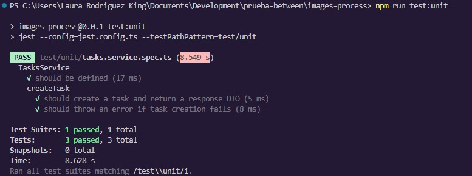

# Task Processing API

## Descripción
Proyecto con servicios encargados de la gestión de tareas para el procesamiento de imágenes, incluyendo la creación, actualización, consulta de tareas y eliminación de las mismas. Las tareas poseen 3 posibles estados (`pending`, `completed`, `failed`) y un precio asociado.

## Tecnologías Utilizadas
- **NestJS**: Framework para la arquitectura del backend.
- **Sharp**: Librería para el procesamiento de imagenes.
- **MongoDB**: Base de datos NoSQL para almacenar las tareas.
- **Docker**: Contenedor para el despliegue del servicio.
- **Jest**: Framework para pruebas unitarias e integración.
- **Kafka**: Broker para la gestión de las tareas.
- **AWS**: Cloud encargado de alojar imagenes y gestionar el despliegue automatizado.
- **Github Actions**: Despliegue automatico.

## Arquitectura elegida del Proyecto: Hexagonal
```
📦 src
 ┣ 📂 application (Controladores y validaciones de entrada)
 ┣ 📂 common (Manejador de excepciones)
 ┣ 📂 config (Configuración para cloud)
 ┣ 📂 domain (Interfaces, modelado, puertos y lógica de negocio)
 ┣ 📂 infrastructure (Conexión a la base de datos, procesador de imagenes, adaptadores)
 ┣ 📜 main.ts (Punto de entrada del servicio)
 ┗ 📜 app.module.ts (Módulo principal de la aplicación)
📦 tests (Pruebas unitarias e integración)
📦 images (aloja imagenes para el procesamiento)
```

## Instalación y Ejecución
### Clonar el repositorio
```sh
git clone https://github.com/lauriy91/imageFlux.git
cd task-processing-service
```

### Instalar dependencias
```sh
npm install
```

### Configurar variables de entorno
Crear un archivo `.env` con el siguiente contenido:
```env
MONGO_URI=mongodb://localhost:27017/image_processing
PORT=3000
AWS_ACCESS_KEY_ID=xxxxxxxxxxxxxxxxxxxxxxxxxxxxxx
AWS_SECRET_ACCESS_KEY=xxxxxxxxxxxxxxxxxxxxxxxxxxxxxx
AWS_REGION=us-east-2
AWS_S3_BUCKET=almacen-photos
```

### Ejecutar en desarrollo
```sh
npm run start:dev
```

### Correr pruebas
```sh
npm run test
```

### Ejecutar con Docker
```sh
docker-compose up --build
```

## Endpoints
### **Crear Tarea**
**POST** `/tasks`
```json
{
  "originalPath": "uploads/image5.jpg"
}
```
**Respuesta:**
```json
{
  "taskId": "67ee17f932a1fb13b8533e64",
  "status": "pending",
  "price": 5
}
```

### **Obtener Tarea por id**
**GET** `/tasks/:taskId`
```json
{
  "taskId": "67ef459dc21a5a2b47a272f7",
  "status": "completed",
  "price": 23,
  "images": [
    {
      "resolution": "1024",
      "path": {
        "local": "C:\\Users\\Laura Rodriguez King\\Documents\\Development\\prueba-between\\images-process\\dist\\images\\output\\imagen-prueba3\\1024\\79180b65962ed2f20aa786b422051191.jpg",
        "cloud": "https://almacen-photos.s3.us-east-2.amazonaws.com/processed/imagen-prueba3_1024_79180b65962ed2f20aa786b422051191.jpg"
      }
    },
    {
      "resolution": "800",
      "path": {
        "local": "C:\\Users\\Laura Rodriguez King\\Documents\\Development\\prueba-between\\images-process\\dist\\images\\output\\imagen-prueba3\\800\\79180b65962ed2f20aa786b422051191.jpg",
        "cloud": "https://almacen-photos.s3.us-east-2.amazonaws.com/processed/imagen-prueba3_800_79180b65962ed2f20aa786b422051191.jpg"
      }
    }
  ]
}
```

### **Obtener Tareas**
**GET** `/tasks`
```json
[
  {
    "_id": "67edfc41cb62af69855d92e9",
    "taskId": "67edfc41cb62af69855d92e9",
    "status": "pending",
    "price": 100,
    "images": "image1.jpg",
    "createdAt": "2025-04-03T03:10:57.181Z",
    "updatedAt": "2025-04-03T03:10:57.181Z"
  },
  {
    "_id": "67edfc6dcb62af69855d92eb",
    "taskId": "67edfc6dcb62af69855d92eb",
    "status": "complete",
    "price": 200,
    "images": "image2.jpg",
    "createdAt": "2025-04-03T03:11:41.961Z",
    "updatedAt": "2025-04-03T03:13:09.465Z"
  },
]

### **Actualizar Tareas**
**PUT** `/tasks/:taskId`
```json
{
  "status": "pending",
  "price": 13,
  "originalPath": "uploads/image.jpg"
}
```
**Respuesta:**
```json
{
  "_id": "67ef459dc21a5a2b47a272f7",
  "status": "pending",
  "price": 13,
  "images": [
    {
      "resolution": "1024",
      "path": {
        "local": "C:\\Users\\Laura Rodriguez King\\Documents\\Development\\prueba-between\\images-process\\dist\\images\\output\\imagen-prueba3\\1024\\79180b65962ed2f20aa786b422051191.jpg",
        "cloud": "https://almacen-photos.s3.us-east-2.amazonaws.com/processed/imagen-prueba3_1024_79180b65962ed2f20aa786b422051191.jpg"
      }
    },
    {
      "resolution": "800",
      "path": {
        "local": "C:\\Users\\Laura Rodriguez King\\Documents\\Development\\prueba-between\\images-process\\dist\\images\\output\\imagen-prueba3\\800\\79180b65962ed2f20aa786b422051191.jpg",
        "cloud": "https://almacen-photos.s3.us-east-2.amazonaws.com/processed/imagen-prueba3_800_79180b65962ed2f20aa786b422051191.jpg"
      }
    }
  ],
  "originalPath": "uploads/image.jpg",
  "createdAt": "2025-04-04T02:36:13.872Z",
  "updatedAt": "2025-04-04T02:36:48.739Z"
}
```

### **Actualizar Tareas**
**PATCH** `/tasks/:taskId`
```json
{
  "status": "completed"
}
```
**Respuesta:**
```json
{
  "_id": "67ef459dc21a5a2b47a272f7",
  "status": "completed",
  "price": 13,
  "images": [
    {
      "resolution": "1024",
      "path": {
        "local": "C:\\Users\\Laura Rodriguez King\\Documents\\Development\\prueba-between\\images-process\\dist\\images\\output\\imagen-prueba3\\1024\\79180b65962ed2f20aa786b422051191.jpg",
        "cloud": "https://almacen-photos.s3.us-east-2.amazonaws.com/processed/imagen-prueba3_1024_79180b65962ed2f20aa786b422051191.jpg"
      }
    },
    {
      "resolution": "800",
      "path": {
        "local": "C:\\Users\\Laura Rodriguez King\\Documents\\Development\\prueba-between\\images-process\\dist\\images\\output\\imagen-prueba3\\800\\79180b65962ed2f20aa786b422051191.jpg",
        "cloud": "https://almacen-photos.s3.us-east-2.amazonaws.com/processed/imagen-prueba3_800_79180b65962ed2f20aa786b422051191.jpg"
      }
    }
  ],
  "originalPath": "uploads/image.jpg",
  "createdAt": "2025-04-04T02:36:13.872Z",
  "updatedAt": "2025-04-04T02:37:28.295Z"
}
```

### **Eliminar Tarea por id**
**DELETE** `/tasks/:taskId`
```Code	Description	Links
200	
Tarea eliminada
```

## Pruebas Unitarias e Integración

Las pruebas se encuentran en el directorio `tests/`. Se han implementado pruebas unitarias para el servicio y pruebas de integración para validar la API completa.

### **Ejecutar Pruebas**
```sh
npm run test
```

## Resultados de las imagenes procesadas

Las imagenes quedan procesadas en 2 resoluciones **1024px** y **800px**, dentro de la carpeta images/output, cada resolucion tiene su imagen debajo de la estructura de nombre: /output/image1/1024/f322b730b287.jpg, si entran a sus propiedades, encuentran la resolución; su otra ubicación, la encuentran en los buckets de S3, dentro de las rutas respuesta.

Adicional, dentro de la carpeta common/utils, encontraran dos tipos de colecciones, una de la base de datos mongodb, y al otra de los resultados de las pruebas en postman.



